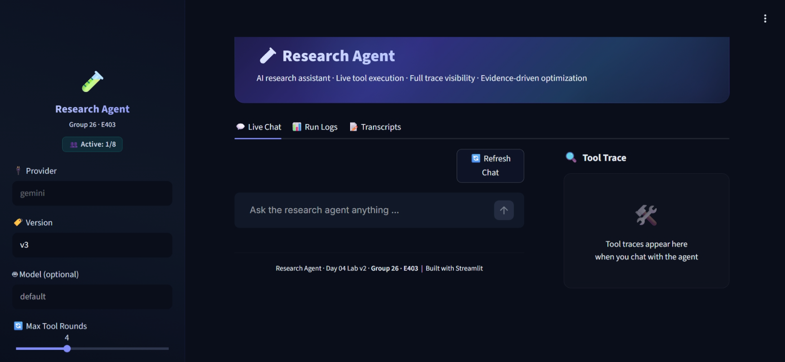

# Báo cáo Day 04 Lab v2 - Tác tử nghiên cứu

## Nhóm

- Nhóm: Group 26
- Thành viên:

| STT | Họ và tên | MSSV |
| :---: | :--- | :---: |
| 1 | Phạm Tuấn Anh | 2A202601070 |
| 2 | Mai Tiến Dũng | 2A202601838 |
| 3 | Nguyễn Thị Thương | 2A202601226 |
| 4 | Nguyễn Đức Anh | 2A202601788 |
| 5 | Nguyễn Hoàng Minh | 2A202601764 |
| 6 | Nguyễn Thái Tú | 2A202601504 |
- Nhà cung cấp/mô hình: Gemini, `gemini-3.5-flash-lite`
 
link streamlit : https://ai-research-agent-g26.streamlit.app/
---

# PHẦN A - Giới thiệu tác tử

## A1. Tác tử này làm được gì

Tác tử nghiên cứu này hỗ trợ tìm tin trên web, đọc URL, tìm bài đăng Twitter/X theo tài khoản hoặc chủ đề, tìm bài báo học thuật/chính sách nội bộ, kiểm tra chất lượng nguồn và tổng hợp thành bản tin Markdown. Tác tử ưu tiên chọn đúng công cụ, truyền đúng tham số, hỏi lại khi thiếu thông tin và xác nhận trước khi gửi Telegram.

**Cách dùng thử:**

- Chưa xây giao diện trong mốc trước UI.
- Dòng lệnh cục bộ: `python chat.py --provider gemini --version v3`

## A2. Các công cụ của tác tử

| Tên công cụ | Chức năng | Công cụ mới do nhóm thêm? |
|---|---|---|
| clarify | Hỏi lại khi thiếu tài khoản/URL/chủ đề hoặc cần xác nhận có/không trước hành động | không |
| timeline | Lấy bài đăng gần đây của một tài khoản Twitter/X cụ thể | không |
| social_search | Tìm bài đăng Twitter/X theo từ khóa/chủ đề | không |
| lookup | Tìm trên web/tin tức theo truy vấn, chủ đề, khoảng thời gian | không |
| fetch | Đọc nội dung một URL cụ thể | không |
| format | Định dạng các mục đã có thành bản tin Markdown | không |
| send | Gửi text lên Telegram sau khi đã được xác nhận | không |
| policy | Tìm trong tài liệu chính sách nội bộ dạng Markdown | không |
| papers | Tìm bài báo học thuật trên arXiv | không |
| paper_text | Trích xuất văn bản từ một bài báo arXiv cụ thể | không |
| source_check | Kiểm tra theo luật kinh nghiệm chất lượng/rủi ro trích dẫn của danh sách URL/tên miền | có |

## A3. Câu hỏi mẫu để thử

1. Tin tức AI hôm nay có gì nổi bật?
2. Lấy 5 tweet mới nhất của Sam Altman.
3. Tóm tắt bài này giúp mình: https://example.com/ai-policy
4. Kiểm tra 2 nguồn này có ổn để trích dẫn không: https://openai.com/research và https://medium.com/example/ai-notes
5. Đăng bản tin này lên Telegram giúp mình.

## A4. Kịch bản trình diễn đã chạy thử

| Kịch bản | Dấu vết công cụ cần thấy | Diễn biến cải thiện phiên bản | Lượt chạy/bản ghi dự phòng |
|---|---|---|---|
| Tin AI hôm nay | `lookup(query=AI, topic=news, timeframe=day)` | v0 sai nhiều tham số/chọn công cụ; v3 bộ cơ sở đạt 20/20 | `runs/v3_B_base_gemini_20260729T155303255458.json` |
| Thiếu URL khi tóm tắt bài viết | `clarify(response_type=text)` | v3 bắt buộc schema `clarify.response_type` để không thiếu tham số | `runs/v3_B_base_gemini_20260729T155303255458.json` |
| Kiểm tra nguồn | `source_check(sources=[...])` | v3 thêm công cụ mới của nhóm và bộ đánh giá nhóm đạt 10/10 | `runs/v3_B_group_gemini_20260729T155622896451.json` |

---

# PHẦN B - Chi tiết / Bằng chứng

Chỉ số hợp lệ khi `provider_error_cases=0` và `measured_cases=total_cases`. v1 có lỗi nhà cung cấp do giới hạn lượt gọi/kết nối Gemini, nên chỉ dùng làm bằng chứng về thay đổi artifact/prompt; v2 và v3 có chỉ số hợp lệ.

## B1. Bằng chứng theo phiên bản

| Phiên bản | Thay đổi prompt/công cụ | Giả thuyết | Tên chỉ số | Trước | Sau | Tệp lượt chạy |
|---|---|---|---|---:|---:|---|
| v0 | Prompt khởi đầu + mô tả công cụ mơ hồ | Bản khởi đầu sẽ sai khi chọn công cụ/tham số/ranh giới | case_accuracy |  | 0.60 | `runs/v0_B_base_gemini_20260729T150444184264.json` |
| v1 | Sửa `system_prompt.md`: chọn công cụ, thiếu thông tin, ngoài phạm vi, xác nhận | Prompt rõ hơn sẽ giảm lỗi công cụ/tham số | case_accuracy | 0.60 | 1.00 trên các ca được đo, provider_error=3 | `runs/v1_B_base_gemini_20260729T152818925363.json` |
| v2 | Sửa `tools.yaml`: mô tả + quy ước tham số | Khai báo công cụ rõ hơn sẽ làm tham số ổn định | case_accuracy | 0.60 | 0.95 | `runs/v2_B_base_gemini_20260729T153116045600.json` |
| v3 | Thêm `source_check`, đánh giá nhóm, bắt buộc `clarify.response_type`, siết truy vấn/xác nhận của `lookup` | Công cụ mới không làm nhiễu việc chọn công cụ cốt lõi và đánh giá nhóm đạt | case_accuracy | 0.95 | 1.00 bộ cơ sở; 1.00 bộ nhóm | `runs/v3_B_base_gemini_20260729T155303255458.json`; `runs/v3_B_group_gemini_20260729T155622896451.json` |

## B2. Phân tích lỗi

| Mã ca | Loại lỗi | Lời gọi công cụ thực tế | Điều chưa đúng | Cách sửa |
|---|---|---|---|---|
| Nhiều ca ở v0 | wrong_tool / missing_info / wrong_boundary / out_of_scope / wrong_arg_value | Hỗn hợp | Prompt khởi đầu khuyến khích đoán bừa, thực hiện một bước và chọn công cụ mơ hồ | v1 viết lại system prompt với quy tắc chọn công cụ và ranh giới rõ ràng |
| R11_missing_url ở v2 | missing_info | `clarify` | Mô hình thiếu hoặc sai `response_type=text` | v3 đưa `clarify.response_type` vào schema bắt buộc |
| R12_confirm_before_send trong lần lặp v3 | wrong_boundary | `clarify(response_type=text)` | Yêu cầu gửi/Telegram cần xác nhận có/không | Prompt v3 ánh xạ send/post/publish/Telegram sang `response_type=yes_no` |
| G03_web_news_month trong lần lặp v3 | wrong_arg_value | `lookup` | Mô hình đưa từ chỉ thời gian/tin tức vào `query` | Prompt v3 quy định `lookup.query` chỉ chứa chủ đề chính; `topic`/`timeframe` giữ phần tin tức/thời gian |

## B3. Các ca đánh giá của nhóm

| Mã ca | Nội dung kiểm tra | Công cụ/hành vi mong đợi | Kết quả |
|---|---|---|---|
| G01_source_check_urls | Yêu cầu kiểm tra độ tin cậy/trích dẫn với URL | `source_check` | PASS |
| G02_fetch_specific_url | Đọc URL cụ thể | `fetch` | PASS |
| G03_web_news_month | Tin web với khoảng thời gian một tháng | `lookup(topic=news,timeframe=month)` | PASS |
| G04_missing_account | Tài khoản mơ hồ | `clarify(response_type=text)` | PASS |
| G05_confirm_publish | Ranh giới khi gửi Telegram | `clarify(response_type=yes_no)` | PASS |
| G06_multiturn_source_check | Ghi nhớ URL qua nhiều lượt | `source_check` | PASS |
| G07_multiturn_limit_correction | Ghi nhớ tài khoản, sửa giới hạn | `timeline(screenname=sama,limit=4)` | PASS |
| G08_multiturn_missing_url_then_url | Thiếu URL rồi bổ sung URL | `fetch` | PASS |
| G09_multiturn_switch_social_to_web | Chuyển từ Twitter sang tin web | `lookup` | PASS |
| G10_multiturn_out_of_scope | Yêu cầu lập trình ngoài phạm vi | Không gọi công cụ | PASS |

## B4. Bằng chứng trò chuyện trực tiếp

| Kịch bản/lượt | Phiên bản | Lời gọi công cụ + tham số | Bản ghi/lượt chạy | Kết quả |
|---|---|---|---|---|
| Nghiên cứu thông thường: "Tin AI hôm nay có gì nổi bật?" | v3 | `lookup(query=AI, topic=news, timeframe=day)` rồi `format(template=daily_ai_vn)` | `transcripts/v3_gemini_20260729T160109179718.transcript.json` | Trả về bản tin AI tiếng Việt có nguồn |
| Thiếu URL: "Tóm tắt bài viết này giúp mình" | v3 | `clarify(response_type=text)` | `transcripts/v3_gemini_20260729T160109179718.transcript.json` | Hỏi người dùng cung cấp URL |
| Ranh giới gửi: "Đăng bản tin này lên Telegram giúp mình" | v3 | `clarify(response_type=yes_no)` | `transcripts/v3_gemini_20260729T160109179718.transcript.json` | Hỏi xác nhận thay vì gửi luôn |

## B5. Bằng chứng năng lực công cụ

| Hạng mục | Tệp bằng chứng | Phần hoạt động đúng | Rủi ro / rào chắn |
|---|---|---|---|
| Bắt buộc: công cụ mới đầu tiên | `tools/source_check/tool.py`, `tools/source_check/TOOL.md`, `runs/v3_B_group_gemini_20260729T155622896451.json` | `source_check` được chọn và thực thi ở cả ca một lượt lẫn nhiều lượt của bộ nhóm | Chỉ là đánh giá theo luật kinh nghiệm, không xác minh sự thật |
| Công cụ dựng sẵn tùy chọn | Vẫn có khai báo `policy`, `papers`, `paper_text`, `send` | Không nhận là công cụ mới của nhóm | Công cụ tùy chọn có thể ảnh hưởng việc chọn công cụ nếu mô tả mơ hồ |
| Điểm cộng: từ công cụ mới thứ tư trở đi | Không có | Không nhận điểm cộng | Không nhận điểm cộng |

## B6. Tổng kết

- Sửa trong `system_prompt.md`: quy tắc chọn công cụ, không đoán bừa, hỏi lại khi thiếu thông tin, xử lý yêu cầu ngoài phạm vi, ranh giới xác nhận trước khi gửi và quy ước truy vấn `lookup` ngắn gọn.
- Sửa trong `tools.yaml`: mô tả công cụ rõ hơn, quy ước tham số, bắt buộc `clarify.response_type` và thêm khai báo cho `source_check`.
- Cần rà soát thủ công: một số lượt chạy Gemini bị lỗi giới hạn lượt gọi; các lượt này không hợp lệ cho chỉ số cuối nếu `provider_error_cases` khác `0`.
- Cải thiện tiếp theo: xây giao diện Streamlit tái sử dụng `run_model_tool_loop`, hiển thị dấu vết công cụ, phiên bản artifact và lưu bản ghi trò chuyện.
